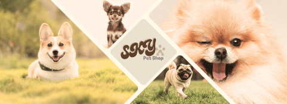

# KingYin_Sham_VueAjax_petshop
This project is a pet shop website built using Vue.js, AJAX, and a Lumen API. It allows users to view a list of available pets, fetch detailed pet information, and interact with the website through a smooth, dynamic interface. The front-end is powered by Vue.js for reactive data binding and real-time updates, while AJAX handles asynchronous communication with the Lumen-powered backend API to fetch pet data. This project demonstrates the integration of modern web development technologies to create an interactive and responsive pet shop experience.

## Installation
To install the back-end of this project, download the Lumen API code and set up the database by importing the provided SQL file into phpMyAdmin. Once the database is in place, configure the .env file with your database credentials, and you can begin browsing the database and running the API locally.

## Usage
It’s recommended to run this project by browsing it on localhost after setting up the database and Lumen API. Once the database is configured and the Lumen API is running, you can access the site directly through your local server for seamless browsing and interaction.

## Contributing

1. Fork it!
2. Create your feature branch: `git checkout -b my-new-feature`
3. Commit your changes: `git commit -am 'Add some feature'`
4. Push to the branch: `git push origin my-new-feature`
5. Submit a pull request :D

## History
7 April 2025

## Credits
Creator: King Yin Sham (SKY)

## License
MIT - see license file for more information.